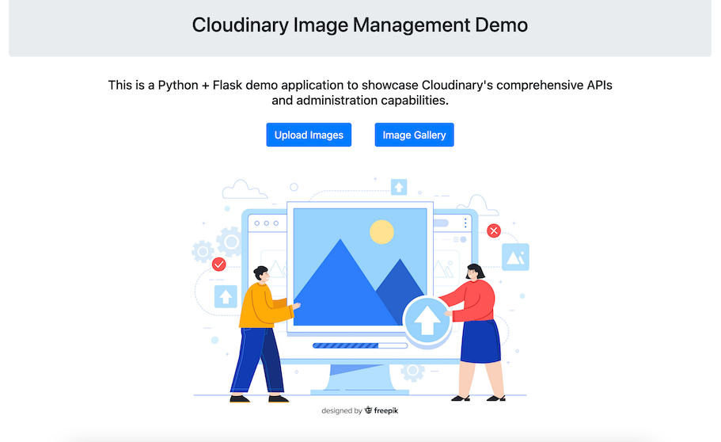

# Cloudinary Image Management Demo

This is a Python + Flask demo application to showcase Cloudinary's comprehensive APIs and administration capabilities.

The tutorial for this repository exists on [LordGhostX's blog](https://www.section.io/engineering-education/authors/solomon-esenyi/).

